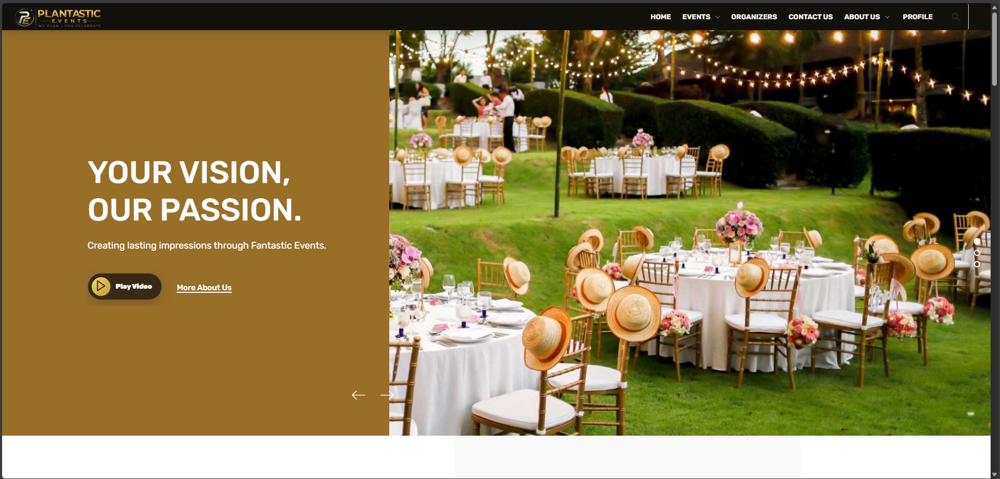
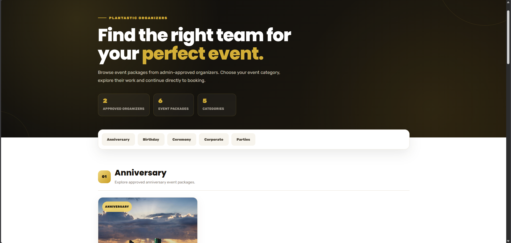
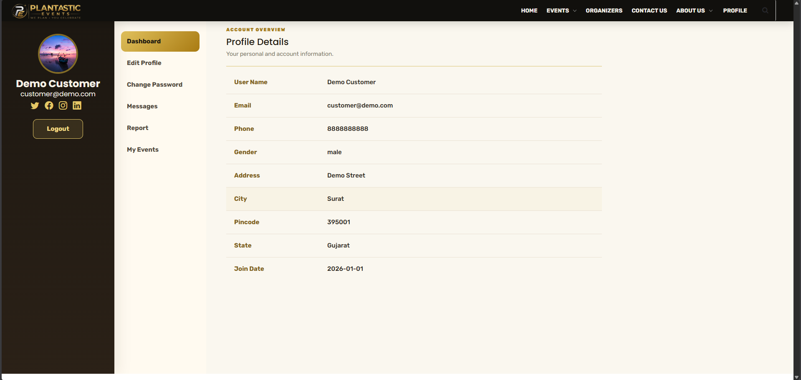
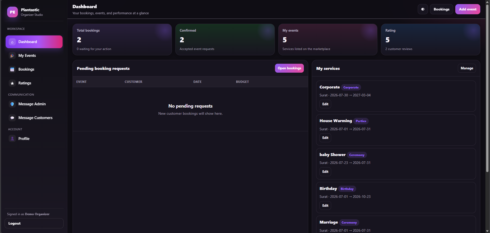
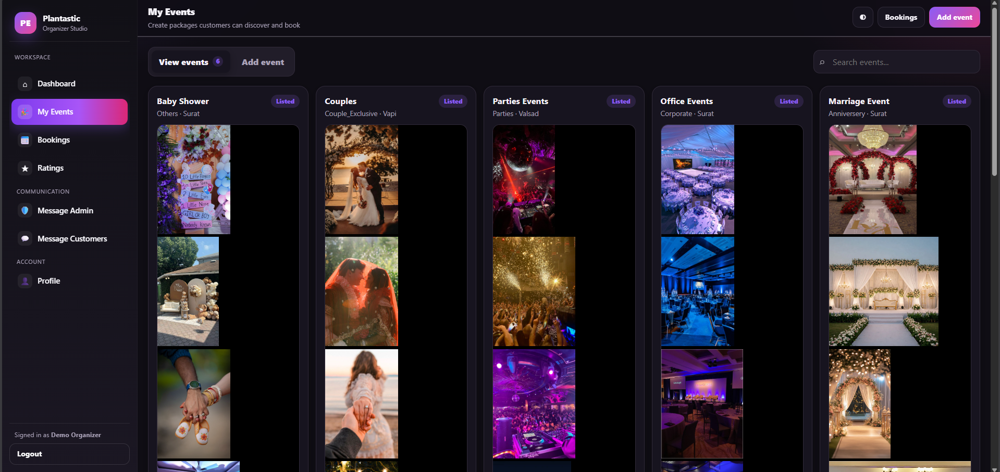
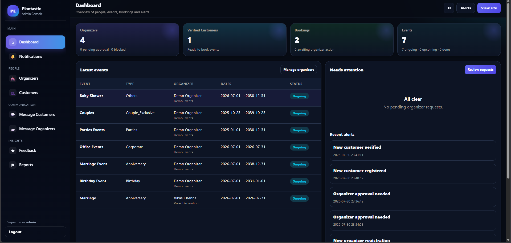

# 🎉 Plantastic Events — Event Management System

Plantastic Events is a web-based Event Management System built using PHP and MySQL. It provides separate modules for **Customers, Organizers, and Administrators**, covering the complete event-booking workflow from organizer registration and approval to event booking, messaging, feedback, and management.

## ✨ Features

### 👤 Customer

- Customer registration and email verification
- Secure login and profile management
- Browse organizers and event packages
- Browse events by category
- Book events
- View booking status and booking history
- Generate confirmed booking receipts
- Message Admin and Organizers
- Submit reports and feedback
- Rate event services

### 🎪 Organizer

- Organizer registration and email verification
- Admin approval before account access
- Organizer dashboard
- Manage profile and business information
- Add and manage event packages
- Upload event images
- Manage customer booking requests
- Communicate with customers
- Track event-related activity

### 🛡️ Admin

- Secure Admin dashboard
- Manage customers
- Review and approve organizers
- Reject or block organizers
- Manage event-related data
- View bookings
- View customer feedback and reports
- Communicate with users
- Monitor platform activity

## 🛠️ Tech Stack

**Frontend**

- HTML5
- CSS3
- JavaScript
- jQuery
- Bootstrap

**Backend**

- PHP
- MySQL / MariaDB
- MySQLi

**Email**

- PHPMailer
- Gmail SMTP / configurable SMTP server

**Development**

- XAMPP
- Composer
- Git & GitHub

## 🔄 Application Workflow

```text
Customer
   ↓
Register → Verify Email → Login
   ↓
Browse Events / Organizers
   ↓
Select Event Package
   ↓
Send Booking Request
   ↓
Organizer Reviews Booking
   ↓
Booking Confirmed
   ↓
Receipt / Messaging / Feedback


Organizer
   ↓
Register → Verify Email
   ↓
Admin Approval
   ↓
Login
   ↓
Manage Events & Bookings


Admin
   ↓
Manage Customers
Approve Organizers
Monitor Bookings
Handle Reports & Feedback
```

## 📁 Project Structure

```text
Plantastic_EMS_Final/
│
├── Admin/              # Administrator module
├── Customers/          # Customer module
├── Organizers/         # Organizer module
├── assets/             # Shared assets
├── database/           # Database schema
├── includes/           # Shared PHP configuration/helpers
├── storage/            # Runtime application data
│
├── .env.example        # Environment configuration example
├── .gitignore
├── composer.json
├── composer.lock
├── conn.php
├── org_verify.php      # Organizer email verification
└── verify.php          # Customer email verification
```

## ⚙️ Requirements

Before running the project, install:

- PHP 8.0+
- MySQL 5.7+ or MariaDB 10.3+
- Apache
- Composer
- PHP extensions:
  - mysqli
  - mbstring
  - openssl

XAMPP can be used for a simple local development environment.

## 🚀 Installation

### 1. Clone the repository

```bash
git clone <repository-url>
```

Move into the project:

```bash
cd Plantastic_EMS_Final
```

### 2. Install PHP dependencies

```bash
composer install
```

Composer installs PHPMailer and other required dependencies into the local `vendor/` directory.

### 3. Create the database

Create a MySQL database named:

```text
event_db
```

Import:

```text
database/event_db.sql
```

Using phpMyAdmin:

```text
phpMyAdmin
→ Create database: event_db
→ Import
→ Select database/event_db.sql
→ Go
```

The repository contains the database structure without private production/user data.

### 4. Configure the application

Copy the example environment configuration:

```text
.env.example
```

Configure the application according to your local or deployment environment.

Required configuration includes:

```text
EMS_APP_URL
EMS_DB_HOST
EMS_DB_USER
EMS_DB_PASS
EMS_DB_NAME
EMS_SMTP_HOST
EMS_SMTP_PORT
EMS_SMTP_USER
EMS_SMTP_PASS
EMS_SMTP_FROM
EMS_ADMIN_EMAIL
```

For a local XAMPP installation, the application URL may look like:

```text
http://localhost/Plantastic_EMS_Final
```

> Never commit real database passwords, SMTP credentials, Gmail App Passwords, API keys, or other secrets to GitHub.

### 5. Run the application

Place the project inside the XAMPP `htdocs` directory:

```text
C:\xampp\htdocs\Plantastic_EMS_Final
```

Start:

- Apache
- MySQL

Then open the Customer application:

```text
http://localhost/Plantastic_EMS_Final/Customers/index-3.php
```

## 🔗 Main Application Routes

| Module                 | Route                      |
| ---------------------- | -------------------------- |
| Customer Home          | `/Customers/index-3.php`   |
| Customer Login         | `/Customers/login.php`     |
| Customer Registration  | `/Customers/register.php`  |
| Organizer Login        | `/Organizers/login.php`    |
| Organizer Registration | `/Organizers/register.php` |
| Admin Login            | `/Admin/login.php`         |

## 📧 Email Verification

Plantastic Events supports email verification using PHPMailer and SMTP.

### Customer flow

```text
Register
→ Verification email
→ Verify account
→ Login
```

### Organizer flow

```text
Register
→ Verification email
→ Verify account
→ Admin approval
→ Login
```

For Gmail SMTP, use a Google App Password rather than storing your normal Gmail password in the application.

## 🔐 Security

The project includes several security improvements:

- Password hashing using `password_hash()`
- Password verification using `password_verify()`
- Prepared statements for sensitive database operations
- CSRF protection
- Session-based authentication
- Session regeneration during authentication
- Email verification
- Organizer approval workflow
- Output escaping for XSS protection
- Sensitive configuration excluded from Git
- SMTP credentials kept outside the public repository

## 📸 Screenshots

Screenshots of the Customer, Organizer, and Admin modules will be added here.

## 📸 Screenshots

### Customer Home


### Browse Organizers


### Customer Profile


### Organizer Dashboard


### Organizer Events


### Admin Dashboard


## 🎯 Project Purpose

Plantastic Events was developed as an academic full-stack project to demonstrate:

- Role-based web application development
- PHP and MySQL integration
- Authentication and authorization
- Event booking workflows
- Database management
- Email verification
- User communication
- Responsive UI development
- Secure backend development practices

## 👨‍💻 Author

**Vikas Chenna**

MCA Student | Aspiring Full Stack Developer

---

If you find this project useful, consider giving the repository a ⭐.
